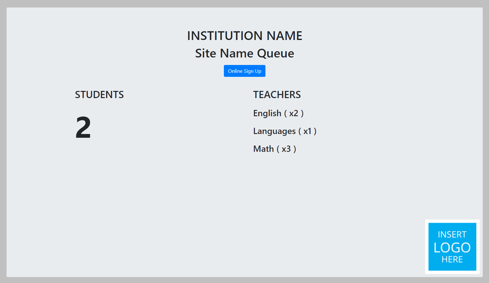
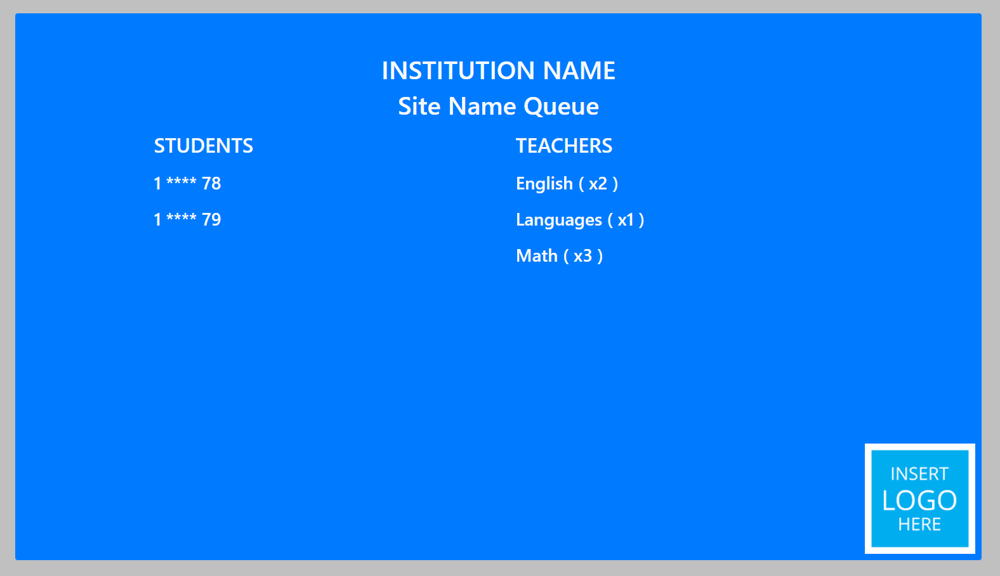
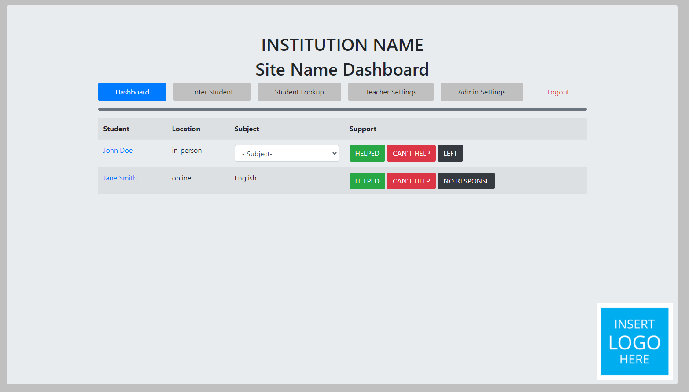
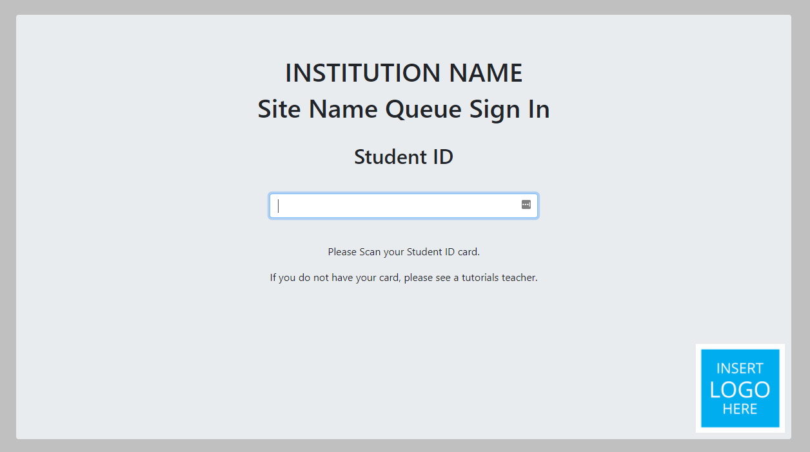
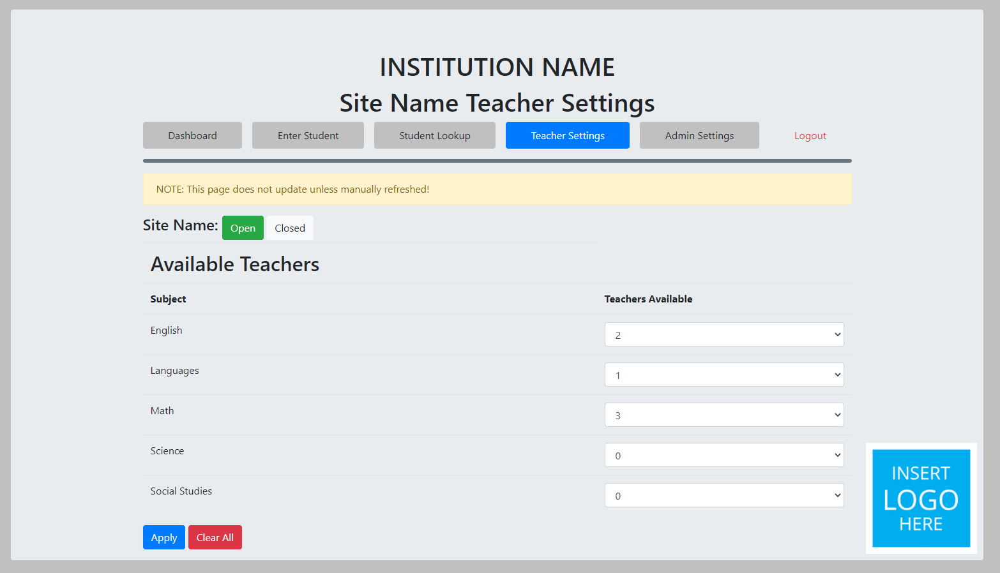
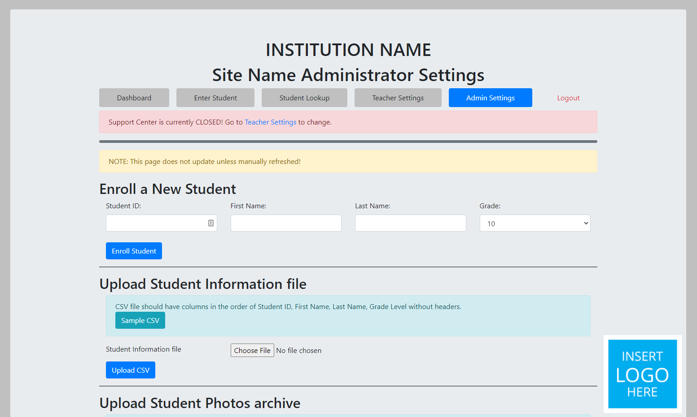

# Tutorials Queue System for Education Institutions
This queue system is for use with in-person or online one-on-one student support. 
## Features
* Teacher Dashboard to record results of teacher-student interaction
    * Mark student support as helped/not-helped/left.
    * Manually enter a student's id into the queue. 
    * Lookup how frequently a student uses the queue and what support received. 
* Public Queue to view how many students are waiting for support
* In person Queue that displays more information with Student IDs within Queue. 
* Teacher Settings
    * Open and close the Queue
    * Change the number of teachers available in the queue. 
* Admin Settings
    * Enroll a student into the Queue database
    * Upload a CSV file of student information into the database. 
    * Upload a zip file of student photos
    * Change the admin or teacher account passwords
    * Change Site wide properties
        * Site Name
        * Institution Name
        * Site Logo and Favicon
        * Site Colors
### Possible Future Features
* [ ] Reset admin password
* [ ] Create additional users
* [ ] Set any user to admin
* [ ] Change subjects available
* [ ] Generate additional reports
* [ ] Export the database
* [ ] Create a new database
* [ ] Add custom timezones (currently set to Mountain Standard)
* [ ] Automatic open and closing times
* [ ] A page for those in queue to see how many students are in front of them. 
* [ ] Change database to mySQL
## Screenshots
#### Public Queue

#### In-Person Queue

#### Teacher Dashboard

#### In Person Card Scanning Station

#### Teacher Settings

#### Admin Settings


## Installation
### Requirements
* Domain name (Optional)
* Ubuntu 18.04 Server or similar
* Python 3.8 or higher
    * Python modules found in [requirements.txt](requirements.txt)
* Sqlite 3.33 or higher
* NginX or Apache web servers

NOTE: This application is developed for and runs on an Amazon EC2 Ubuntu 18.04 server with Python 3.8 and NginX.
### Instructions
#### Ubuntu Server
1. Setup an Ubuntu Web Server using [Amazon Web Services](https://aws.amazon.com/), [Digital Ocean](https://www.digitalocean.com/), or another alternative. If you are within Alberta, Canada, you can create a web server using Cybera's [Rapid Access Cloud](https://www.cybera.ca/services/rapid-access-cloud/), which is hosted from the University of Alberta or the University of Calgary. Many hosting services have tutorials to create the server. 
    * NOTE: Amazon offers a [free tier](https://aws.amazon.com/free/?all-free-tier.sort-by=item.additionalFields.SortRank&all-free-tier.sort-order=asc) with a year of online server use. 
2. Download the project files or use git to clone them into your server.
   ```
   git clone https://github.com/technerdmike/supportCentreQueue.git
   ```
3. Digital Ocean has a comprehensive tutorial to install Python Flask applications found [here](https://www.digitalocean.com/community/tutorials/how-to-serve-flask-applications-with-uswgi-and-nginx-on-ubuntu-18-04).
    * If you have a domain, ensure that the domain points to your server's IP address.
    * NOTE: in the virtual environment, install all python modules using the following code:
      ```
      pip install requirements.txt
      ```
4. Head to the site's page and the setup will begin!
5. Once setup is complete, reboot the server
## Deploying
Below is a brief explanation of the main web pages:
* "/" - The public queue
* "/queue" - The in-person queue with the order of the students with first and last two digits of their student ID.
* "/signin" - The ID card scanning page. This page can be full-screen with an automatic barcode scanner attached to the computer at the entrance of the room. 
* "/dashboard" - Where teachers and admin login to view and manage students within the queue. 